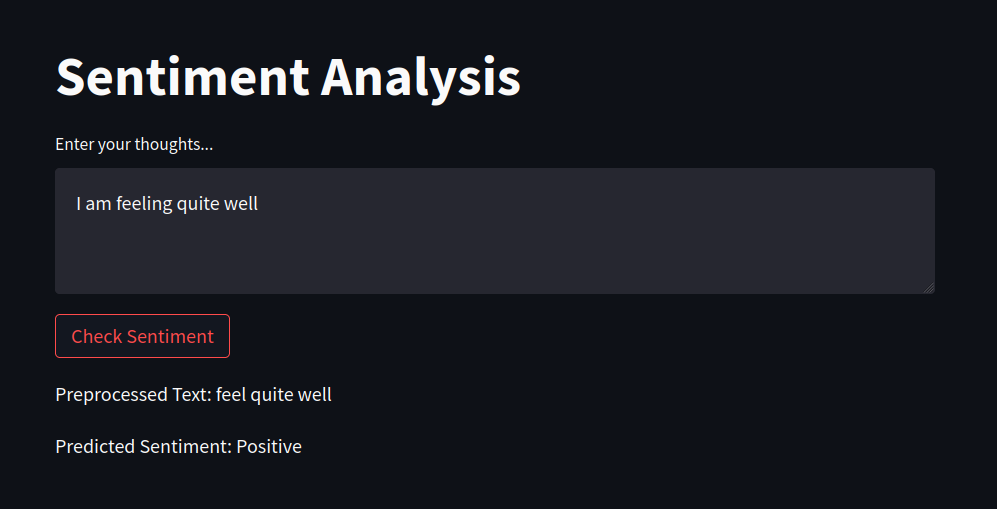
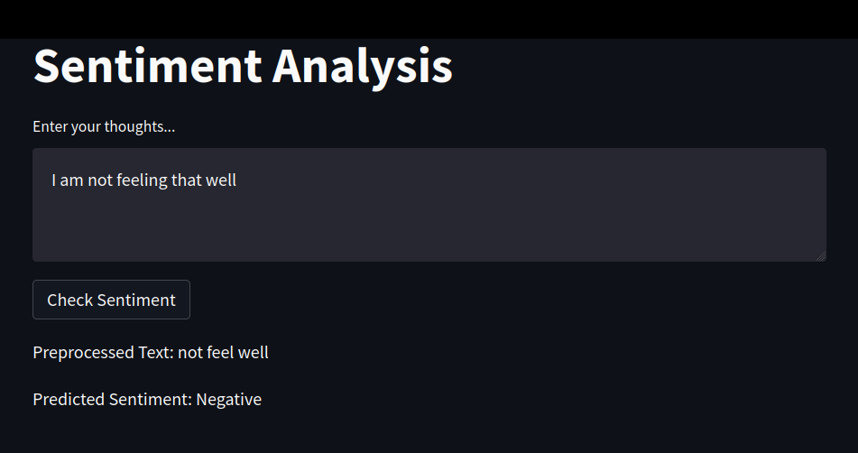

# Sentiment Analysis using IMDB Dataset

This is a sentiment analysis application made using streamlit and transformers.

## Run the app

### Run the frontend
```bash
pip install -r requirements.txt

streamlit run infer.py
```

### Infer directly using a python script
```python
from infer import infer_sentiment

preprocessed_text, sentiment = infer_sentiment("I am not feeling that good")

print(preprocessed_text, sentiment)

```


## Model creation

The script for model creation is `model_generation.ipynb` and can be viewed in colab from the link: https://colab.research.google.com/drive/16wi93nzmMOl19Duc5TSI9wTQbm_OBv6b?usp=sharing

Libraries Used:
* Huggingface Transformers
* PyTorch
* Streamlit for the frontend

Data Preprocessing: Preprocessing happens using the `Preprocessor` module present in `preprocessor.py` script.
It does the following operations:
* Cleans a sentence by removing unwanted characters / words
* Removes stop words (except negative ones) and lemmatizes
* Removes extra spaces

Model Development:
* Model was developed using pretrained `bert-base-uncased 	110M 	English` transformer, https://huggingface.co/bert-base-uncased
* Dataset used was `IMDB` with 2 classes 'pos' and 'neg', https://huggingface.co/datasets/imdb
* Finetuned model can be found at: https://huggingface.co/hazardous/bert_base_uncased_finetuned_imdb


Model Training and Testing:
* Dataset provided training and testing split with 25000, 25000 training points respectively.
* validation split on the training set was performed using 0.15 of its size.
* 1500 examples were used for testing instead of all 25000

## Classification Report
```
              precision    recall  f1-score   support

         neg       0.88      0.87      0.87       762
         pos       0.87      0.87      0.87       738

    accuracy                           0.87      1500
   macro avg       0.87      0.87      0.87      1500
weighted avg       0.87      0.87      0.87      1500
```

## Screenshot and Demo



Demo Link: https://drive.google.com/file/d/1eI-bMJ01O8DeLh7pYoOPIzPcse5b14Ek/view?usp=sharing